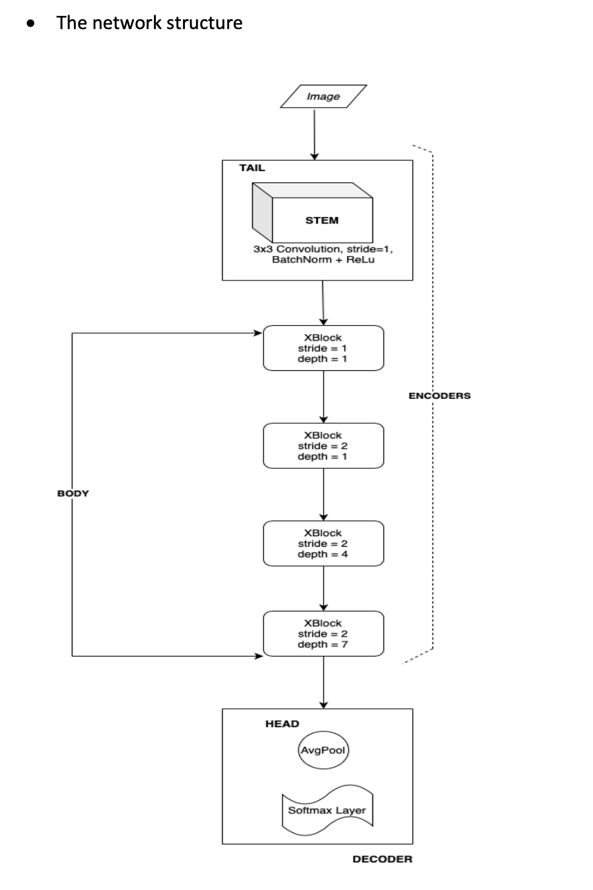
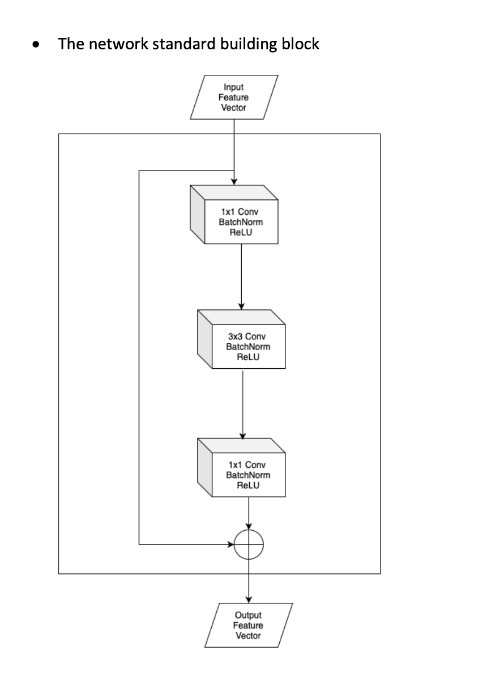
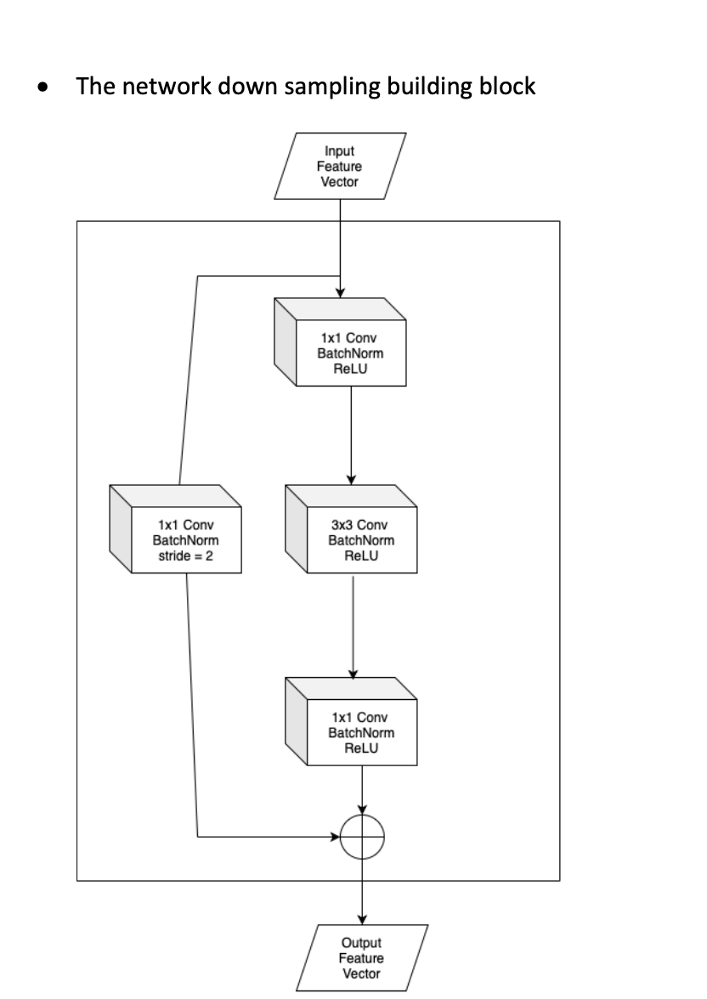
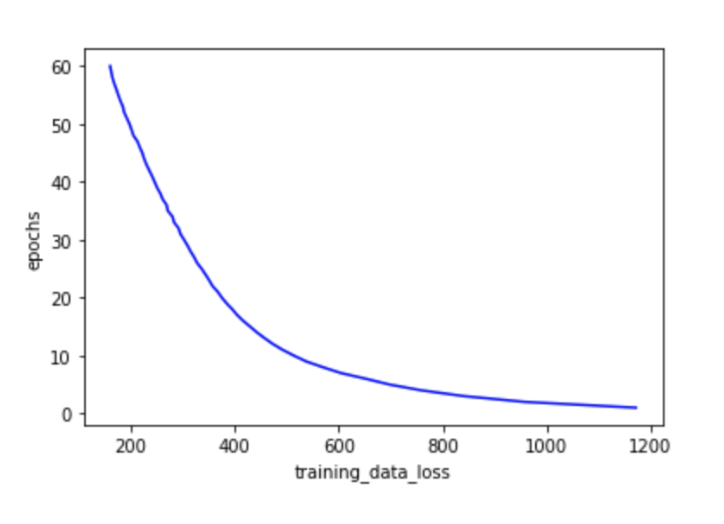
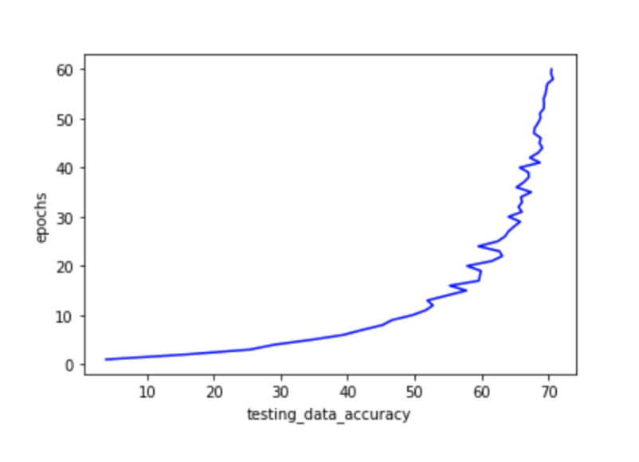

# *Implementing RegnetX-200MF CNN Architecture*

Image classification in PyTorch for ImageNet reduced to 100 classes and down sampled such that the short side is 64 pixels and the long side is >= 64 pixels. This script achieved a best accuracy of 70.72% on epoch 58 with a learning rate at that point of 0.000068 and time required for each epoch of ~ 236.86 s.

# Design

# Training Hyperparameters

1. <ins><b> Learning Rate: </ins></b> lr_schedule is used for updating learning rate. Best accuracy was achieved at learning rate of 0.000068.
2. <ins><b> Optimizer: </ins></b> Adam Optimizer 
3. <ins><b> Epochs: </ins></b> Code ran for 60 iterations.

# How to run

1. Go to Google Colaboratory: https://colab.research.google.com/notebooks/welcome.ipynb
2. File - New Python 3 notebook
3. Cut and paste this file into the cell (feel free to divide into multiple cells)
4. Runtime - Run all

# Plots

## <ins>NOTE:</ins>

1. For a mapping of category names to directory names see:
   https://gist.github.com/aaronpolhamus/964a4411c0906315deb9f4a3723aac57
   
2. The original 2012 ImageNet images are down sampled such that their short side is 64 pixels (the other side is >= 64 pixels) and only 100 of the original 1000 classes are kept.

3. RegnetX image classifier is modified as follows:
- Stride = 1 (instead of stride = 2) in the stem.
- The first stride = 2 down sampling building block in the original network is replaced by a stride = 1 normal building block.
- The fully connected layer in the decoder outputs 100 classes instead of 1000 classes.

The original RegNetX takes in 3x224x224 input images and generates Nx7x7 feature maps before the decoder. This modified RegNetX will take in 3x56x56 input images and generate Nx7x7 feature maps before the decoder.
